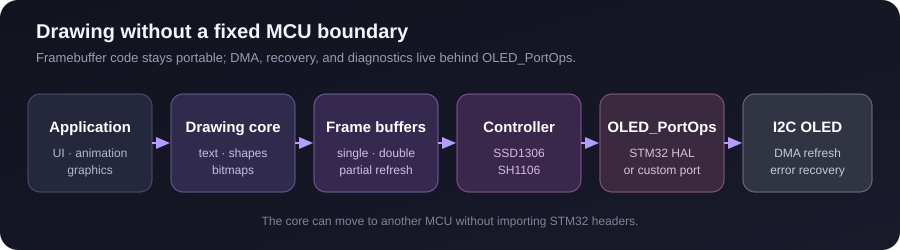

<p align="center"><a href="README_ZH.md">中文</a> · <strong>English</strong></p>

<h1 align="center">STM32 HAL SSD1306 / SH1106 OLED</h1>

<p align="center">
  Drawing, text, DMA refresh, and double buffering without tying the display core to one MCU.
</p>

<p align="center">
  <a href="https://github.com/akasa828/STM32-HAL-SSD1306-SH1106/releases/latest"></a>
  <a href="https://github.com/akasa828/STM32-HAL-SSD1306-SH1106/actions/workflows/ci.yml"></a>
  
  
  <a href="LICENSE"></a>
</p>

<p align="center">
  <a href="#run-the-demo">Run the demo</a> ·
  <a href="#use-the-driver-in-another-project">Reuse the driver</a> ·
  <a href="docs/API.md">API</a> ·
  <a href="docs/PORTING.md">Porting</a> ·
  <a href="https://github.com/akasa828/STM32-HAL-SSD1306-SH1106/issues">Issues</a>
</p>

<p align="center">
  
</p>

This repository is for the point where a small OLED example turns into part of
an application: the screen is refreshed through DMA, drawing can continue in a
back buffer, failures have a recovery boundary, and the core does not own a
global STM32 I2C handle. It is the display layer used by the animated UI and
video output in [SD Card OVID Player](https://github.com/akasa828/SD_Card_OVID_Player).

## Why this repository exists

| | What you get |
|---|---|
| Portable boundary | `OLED_PortOps` supplies transfer, abort, recovery, timing, and diagnostic callbacks without exposing HAL types to the core. |
| More than text output | Points, lines, rectangles, circles, bitmaps, ASCII text, numbers, progress bars, scrolling, mirror, inverse, and rotation. |
| Predictable frame handling | Single or double buffering, full refresh, partial refresh, DMA completion, timeout, and error accounting. |
| Controller separation | SSD1306 and SH1106 have separate initialization paths, column offsets, and command behavior. |
| Reproducible example | STM32F103C8T6 project, CubeMX file, CMake presets, ST-Link launch configuration, and VS Code `F5` workflow. |

## At a glance

| Item | Support |
|---|---|
| Controllers | SSD1306, SH1106 |
| Transport | I2C through a user-provided port |
| Common modules | 128×32, 128×64, 96×64; other macro sizes remain subject to physical controller limits |
| Address | Configurable 7-bit address, commonly `0x3C` or `0x3D` |
| Frame memory | `width × ceil(height / 8)` bytes per buffer |
| Example target | STM32F103C8T6, I2C1 DMA on PB6/PB7 |

## Run the demo

1. Download or clone the repository and open its **root directory** in VS Code.
2. Install the recommended official STM32 extension and accept the Bundle
   Manager tool installation.
3. Connect the OLED and ST-Link.
4. Select `Debug` or `Release`, press `F5`, then choose
   `OLED demo: Build, flash and debug`.

| OLED | STM32F103C8T6 |
|---|---|
| VCC | 3.3 V |
| GND | GND |
| SCL | PB6 / I2C1 SCL |
| SDA | PB7 / I2C1 SDA |

The demo draws a frame and text, then moves a small block. That single screen
checks initialization, drawing, I2C DMA, and buffer swapping together.

> [!NOTE]
> Module pull-ups, cable length, address straps, and controller variants differ.
> If the display is unstable, verify the address and reduce the I2C clock before
> changing drawing code.

## Use the driver in another project

Copy the portable core:

```text
Core/OLED/
```

STM32 HAL projects can also copy:

```text
Core/Port/oled_stm32_hal.c
Core/Port/oled_stm32_hal.h
```

Bind the port before initialization:

```c
OLED_STM32_HAL adapter = {
    .i2c = &hi2c1,
    .reinitialize = my_i2c_reinitialize,
};

OLED_STM32_HAL_Attach(&adapter);
OLED_Init();
```

Forward only matching HAL events:

```c
void HAL_I2C_MemTxCpltCallback(I2C_HandleTypeDef *i2c)
{
    OLED_STM32_HAL_HandleTxComplete(&adapter, i2c);
}

void HAL_I2C_ErrorCallback(I2C_HandleTypeDef *i2c)
{
    OLED_STM32_HAL_HandleError(&adapter, i2c);
}
```

Then draw and present a frame:

```c
OLED_GRAM_Clear();
OLED_Show_String("HELLO", "1206", 4, 4);
OLED_Draw_Rectang(0, 0, OLED_WIDTH - 1, OLED_HEIGHT - 1, 0);
OLED_Swap_Buffers();
```

For another MCU, implement `OLED_PortOps` instead of using the HAL adapter.
The [porting guide](docs/PORTING.md) describes the callback contract and RAM
formula; the [API reference](docs/API.md) covers drawing and refresh behavior.

## Display configuration

```c
#define OLED_WIDTH 128
#define OLED_HEIGHT 64
#define OLED_CONTROLLER OLED_CONTROLLER_SSD1306
#define OLED_I2C_ADDRESS_7BIT 0x3C
```

The example also accepts CMake overrides:

```powershell
cmake --preset Debug -DOLED_WIDTH_OVERRIDE=128 -DOLED_HEIGHT_OVERRIDE=32 -DOLED_I2C_ADDRESS_OVERRIDE=0x3D
cmake --build --preset Debug
```

The framebuffer calculations are generic, but the physical controller still
determines usable columns, rows, addressing, and supported commands. SH1106
hardware-scroll calls deliberately do nothing rather than sending SSD1306
scroll commands.

## Verification

Every push and pull request checks:

| Check | Current coverage |
|---|---|
| Host regression tests | Drawing and clipping, controller modes, buffering, DMA failures, STM32 HAL adapter |
| Static analysis | `cppcheck` warning, performance, and portability checks |
| Firmware matrix | Debug and Release for SSD1306 128×32, 128×64, 96×64, 128×128 compile path, and SH1106 128×64 |

The 128×128 entry verifies size-dependent code and memory at compile time; it
does not claim that a particular SSD1306 module physically exposes 128 rows.
Electrical behavior and controller clones still require target-board testing.

## Project map

- `Core/OLED/` — driver core, buffers, drawing, fonts, and UI helpers.
- `Core/Port/` — STM32 HAL I2C adapter.
- `Core/Src/main.c` — ready-to-flash STM32F103 demo.
- `tests/` — host-side drawing, mode, and adapter regression tests.
- `docs/` — [API](docs/API.md) and [porting](docs/PORTING.md) references.

Contributions and module reports are welcome; see
[CONTRIBUTING.md](CONTRIBUTING.md). If the driver saved you time, a star helps
other embedded developers find it too.

Project-owned code uses the [MIT License](LICENSE). STM32 HAL and CMSIS keep
their own licenses; see [third-party notices](THIRD_PARTY_LICENSES.md).
